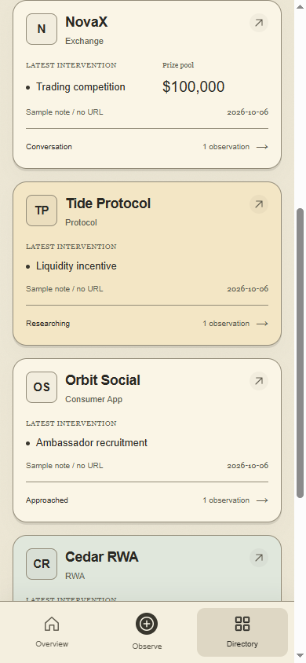

# Horizontal company cards

Verified on 6 October 2026. The screenshot-guided change uses one company per full-width row on every screen.

## Layout

The shared `ProjectCard` now groups logo/name/category/domain, latest intervention/optional value, source/date/history, and the status/observation-count footer. Desktop aligns details across the card; phones use a compact header and paired intervention/value fields. Fixed tall minimums and the two-column phone grid are removed. Missing values are omitted; empty histories remain honest. All existing card fields and canonical navigation remain available, with theme surfaces supplied by the existing tokens. The open icon uses a native SVG.

The same component is used by Worker, Admin and the earlier local demo, on Overview and Directory. Summary/intervention cards retain their own layouts. The mobile Intervention Report retains its horizontally scrollable table and pinned Project column.

## Checks

- Lint, TypeScript and production build: pass.
- Existing tests: 41 passed, 0 failed.
- 45 directory checks: Worker, Admin and local demo × three themes × 1440/1024/768/390/320 px. One full-width horizontal card per row, no content/page overflow, and missing-value/zero-observation cases passed. [Results](horizontal-cards-responsive-results.json).
- Cards open canonical company records; returning to Overview preserves the row layout.
- Minimum sampled card text contrast: 5.06:1. Native buttons, visible keyboard focus and existing reduced-motion support remain.
- Browser runtime errors: none on tested production-build screens.

## Screenshots

[Paper phone with NovaX and Tide](horizontal-cards-paper-phone.png)

[Ifagrithm phone](horizontal-cards-ifagrithm-phone.png) · [Terminal phone](horizontal-cards-terminal-phone.png) · [Paper desktop](horizontal-cards-paper-desktop.png)

## Boundaries

This change is presentation only. No data model, authentication, capture, duplicate/review operation, paid logo service or Supabase activation was changed. Existing previews remain explicitly fictional/read-only; the earlier local demo keeps its browser-local capture data. Long content may increase a card's height so details can wrap without losing meaning. No new records, company claims or amounts were added.
