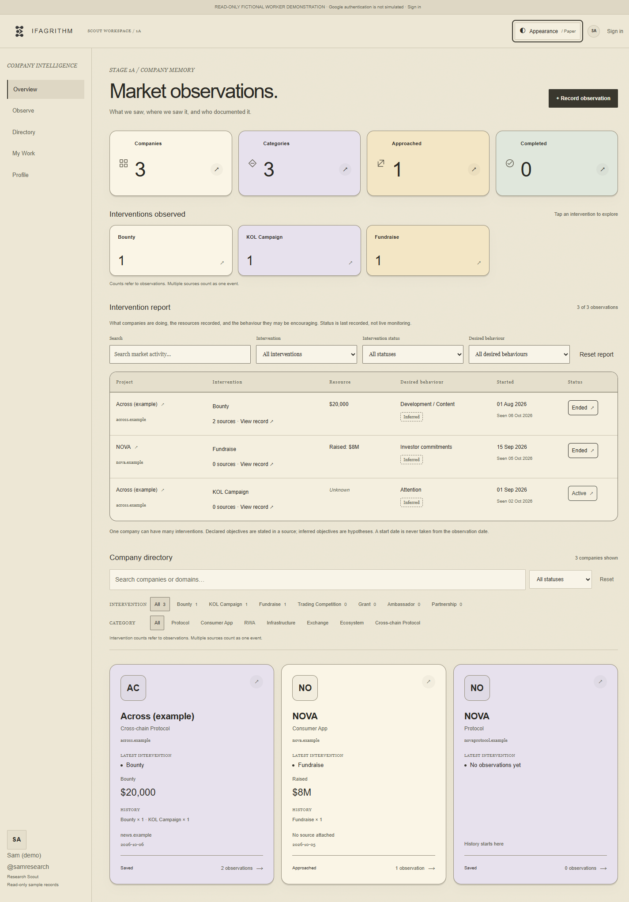
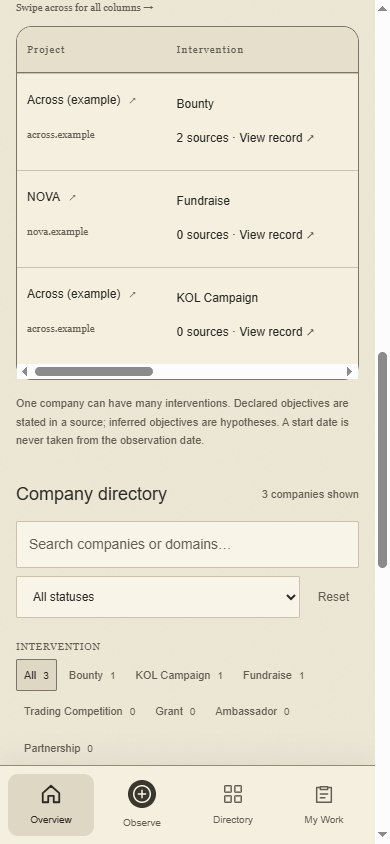
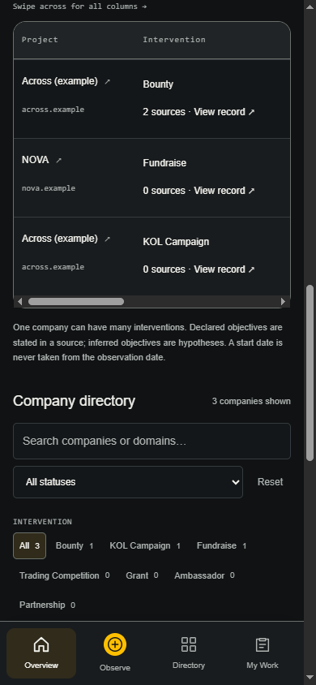
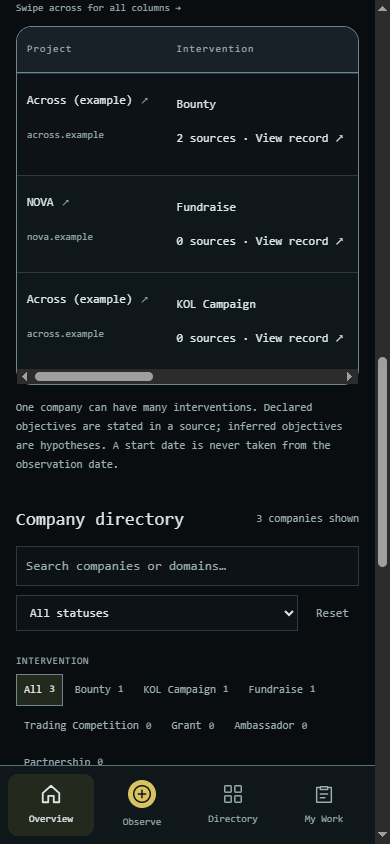

# Intervention Report verification

Verified on 6 October 2026. This is an additive Stage 1A change; Supabase is not activated.

## Delivered

Overview now follows: summary cards → intervention cards → **Intervention Report** → company directory. The shared report appears in Worker, Admin and the earlier browser-local demo.

The six columns are Project, Intervention, Resource, Desired Behaviour, Started and Status. Search combines with intervention, lifecycle and desired-behaviour filters. Project links open the canonical company; intervention links filter the directory; status buttons filter the report; record links expose the observation/evidence (company history in the earlier local demo).

Capture has an optional, collapsible context section. An entered objective requires an explicit Declared/Inferred basis. Start date is separate from observation date. Intervention lifecycle is separate from company commercial status. Missing historical values remain unknown/not recorded. Existing source URLs still represent evidence for one event, not separate interventions. Fundraises show “Raised” rather than silently interpreting proceeds as a campaign budget. Creator counts and partner names are not converted into resource amounts.

## Architecture and preserved boundaries

- Shared `InterventionReport` and `InterventionFields` components use the existing theme tokens.
- Typed model/normalizer and adapters support both the canonical snapshot and earlier browser-local records.
- The stored `behaviour` field remains compatible; the visible vocabulary distinguishes interventions from desired behaviour.
- Company, observation, source and profile IDs, canonical domain matching, duplicate handling, attribution, roles and review operations remain intact.
- A prepared additive migration adds five optional observation-context fields and a wrapper capture RPC. It validates context and reuses the original atomic, permission-protected capture. Possible duplicate responses cannot overwrite an existing observation. Original RPC remains for older clients.
- No production database, Google configuration, external provider, private Terminal, public website or Stage 1B was changed.

## Checks

| Check | Result |
| --- | --- |
| `npm run lint` | Pass |
| `npm run typecheck` | Pass |
| `npm test` | 41 passed, 0 failed |
| `npm run build` | Pass |
| Browser runtime errors | None on tested production screens |
| Combined search/filter/reset/empty state | Pass |
| Project, intervention, status and evidence navigation | Pass |
| Theme switch preserves report state | Pass |
| Browser-local capture and reload persistence | Pass |
| Missing objective basis | Rejected before save |
| Duplicate protection and database authorization regressions | Pass in PGlite tests |

## Responsive and accessibility checks

The initial report pass exercised 1440, 1024, 768, 390 and 320 px under Ifagrithm, Paper and Terminal. **165 scene checks** covered Worker/Admin/local Overview, company/evidence records and optional capture. Initial results: [responsive matrix](intervention-responsive-results.json). That pass used a stacked phone layout; the mobile table correction below supersedes it.

The report now remains a six-column semantic table at every width. On phones, only the report scrolls horizontally, and the Project column/header stay pinned while viewing later columns. A visible swipe hint and keyboard-focusable labelled region make scrolling discoverable. Existing bottom navigation remains accessible. Long values wrap within their table columns.

The table has a descriptive caption and six scoped column headers; all search/filter controls have labels, links are native buttons, selection states use `aria-pressed`, and keyboard focus is visible. Computed report text/background contrast checks found minima of 7.43:1 (Ifagrithm), 4.86:1 (Paper) and 6.97:1 (Terminal), excluding decorative backgrounds. Existing reduced-motion styling remains in force. Capture labels now use a theme token instead of an inherited fixed pale colour, keeping Paper labels legible. These are browser accessibility basics, not a manual screen-reader audit.

## Production-build screenshots

[Paper desktop Overview](intervention-paper-desktop.png)

| Paper phone | Ifagrithm phone | Terminal phone |
| --- | --- | --- |
|  |  |  |

[Paper phone after horizontal scrolling](intervention-paper-mobile-scrolled.png)

[Optional capture context on phone](intervention-capture-mobile.png)

## Mobile table correction

The earlier phone-only row/card layout has been removed. All six column headers and table rows remain visible in the table structure at every width. At 390/320 px the table scrolls within its own region, the Project column/header stay pinned, and Status is reachable at the right edge. Desktop retains the existing table layout.

A fresh **45-check matrix** covers Worker/Admin/local report tables at 1440, 1024, 768, 390 and 320 px in all three themes: [table responsive results](intervention-table-responsive-results.json). All checks pass for real table semantics, headers, pinned columns, reachable final columns, button contents and page bounds. Horizontal overflow is intentional inside the report only. Native ArrowRight scrolling moved the focused region by 40 px with a visible focus outline. Existing filtering and company/evidence navigation continue to work. Lint, TypeScript, all 41 tests and the production build passed again for this correction.

## Intentional limits and next activation step

Worker/Admin previews remain fictional and read-only. `/demo` remains browser-local; legacy attribution does not simulate authenticated Google accounts. No live external authentication or shared storage was exercised. Lifecycle status is the last recorded state, not live monitoring; desired behaviour is an objective/hypothesis, not evidence that participants achieved it. There is no AI enrichment or automatic start-date inference.

After visual approval, follow [AUTH-SETUP](../docs/AUTH-SETUP.md), apply both migrations in order (only the additive migration for an existing Stage 1A schema), configure the dedicated Supabase/Google project, and verify with two real test accounts before team use. Activation is a separate step.
